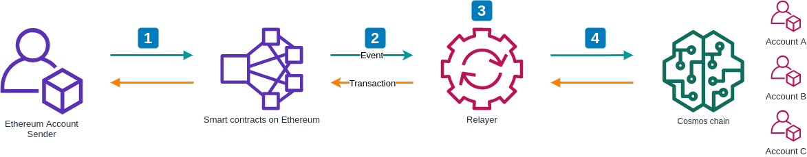

<!-- @format -->

<h1 align="center">Welcome to GoldenStarSwap 👋</h1>
<p>
  
</p>
# Architecture



# Setup

### 1. Make tool

In the project root directory

```bash
make
```

Then create the following folders in `cmd/ebrelayer/contract/generated/bindings/`:

- BridgeBank
- BridgeRegistry
- CosmosBridge
- Oracle
- Valset

### 2. Setup cosmos chain

```bash
# Initialize the genesis.json file that will help you to bootstrap the network
ebd init local --chain-id=peggy

# Configure your cli to use the keyring-backend test so that you don't need to enter a password
# **_NOTE_** Don't use the test backend on production
ebcli config keyring-backend test

# Add some more configuration to avoid using flags
ebcli config chain-id peggy
ebcli config trust-node true
ebcli config indent true
ebcli config output json

# Create a key to hold your validator account and for another test account
ebcli keys add validator --output json > validator.json
ebcli keys add testuser --output json > testuser.json

# Initialize the genesis account and transaction
ebd add-genesis-account $(ebcli keys show validator -a) 1000000000stake,1000000000atom

# Create genesis transaction
ebd gentx --name validator --keyring-backend test

# Collect genesis transaction
ebd collect-gentxs

# Now its safe to start `ebd`
ebd start
```

Open new terminal

### 3. Deploy smart contract lên ropsten

In the project root directory

```bash
ebcli tx send validator \$(ebcli keys show testuser -a) 10stake --yes
yarn peggy:all
```

Check Contracts Address

```bash
cd testnet-contracts
npx truffle network
```

Format Result

```bash
Network: ropsten (id: 3)
BridgeBank: 0x32f82eeB46ed9c2AA0114e4B961cfcEBF18384Df
BridgeRegistry: 0x14d268ed94340f757b253CdeBd3b3528B83aBdb1
BridgeToken: 0x032A87fa8BA6031A4358213648B5eD5E72813A33
CosmosBridge: 0x86C41cb7CbCC55919dFf52Ac9b8ac84D4ddBE2DA
Migrations: 0x00c3b1ba15c5dD86Cf9253CA6b05e4617eeD3d3E
Oracle: 0xad0023F9ebEF7741F399136F9Ca9276F3028b52B
Valset: 0x1b8E9eBE7685D3d5a6f7Ce012f2e9738cD1E9Ef7
```

### 4. Run relayer

```bash
ebrelayer generate
ebrelayer init tcp://localhost:26657 wss://ropsten.infura.io/ws/v3/[Infura-Project-ID] [BridgeRegistry-ContractAddress] validator --chain-id=peggy
```

Open new terminal

### 5. Transfer money

#### 5.1 Tranfer ETH/ERC20 from Ethereum to Cosmos

Run bellow command to get testuser Address

```bash
ebcli query account \$(ebcli keys show testuser -a)
```

Format result

```json
{
  "type": "cosmos-sdk/Account",
  "value": {
    "address": "cosmos1pgkwvwezfy3qkh99hjnf35ek3znzs79mwqf48y",
    "coins": [
      {
        "denom": "stake",
        "amount": "10"
      }
    ],
    "public_key": "cosmospub1addwnpepqwpznlktnvxvyxccslnp58janc6zk83huww6aynzq77ur2dvsfskct0atl9",
    "account_number": 3,
    "sequence": 7
  }
}
```

Transfer ETH

```bash
yarn peggy:lock cosmos1pgkwvwezfy3qkh99hjnf35ek3znzs79mwqf48y 1000 eth --network ropsten
```

Transfer ERC20

```
yarn token:lockERC20 cosmos1pgkwvwezfy3qkh99hjnf35ek3znzs79mwqf48y 1000 dai --network ropsten
```

Query Account

```
ebcli query account \$(ebcli keys show testuser -a)
```

```json
{
  "type": "cosmos-sdk/Account",
  "value": {
    "address": "cosmos1pgkwvwezfy3qkh99hjnf35ek3znzs79mwqf48y",
    "coins": [
      {
        "denom": "stake",
        "amount": "10"
      },
      {
        "denom": "eth",
        "amount": "1000"
      },
      {
        "denom": "eth",
        "amount": "1000"
      }
    ],
    "public_key": "cosmospub1addwnpepqwpznlktnvxvyxccslnp58janc6zk83huww6aynzq77ur2dvsfskct0atl9",
    "account_number": 3,
    "sequence": 9
  }
}
```

### 6. Rest server

```bash
ebcli rest-server --unsafe-cors
```
